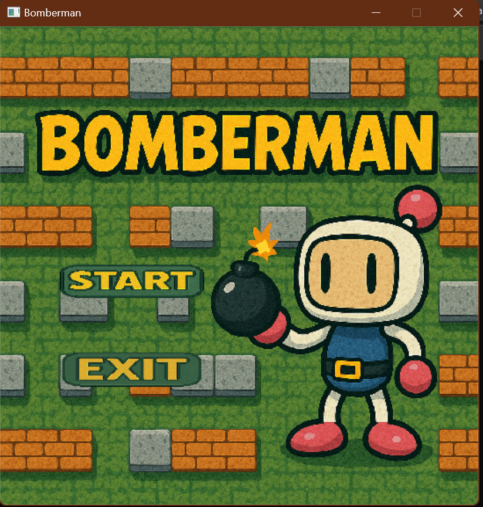

# Bomberman Game

   

Bomberman là một loạt trò chơi điện tử cổ điển kết hợp các yếu tố giải đố, mê cung và chiến lược. Ban đầu được phát triển bởi Hudson Soft và hiện thuộc sở hữu của Konami, loạt trò chơi này đã giải trí cho người chơi từ khi ra mắt vào năm 1983.

## 🎮 Cách chơi
- 🏃 **Di chuyển**: Sử dụng các phím điều hướng di chuyển ↑, ↓, ←, →.
- 💥 **Đặt boom**: bấm phím Space để đặt boom phá hủy.
- ⚔️ **Tiêu Diệt Kẻ Thù**: Sử dụng bom để tiêu diệt kẻ thù và dọn đường.
- 🛡️ **Thu Thập Sức Mạnh**: Tăng cường khả năng của bạn bằng cách thu thập các vật phẩm.
- 🔄 **Đến Lối Ra**: Tìm và đến được lối ra để tiến đến màn chơi tiếp theo.

## Mô tả về các đối tượng trong trò chơi
Nếu bạn đã từng chơi Bomberman, bạn sẽ cảm thấy quen thuộc với những đối tượng này. Chúng được được chia làm hai loại chính là nhóm đối tượng động (*Bomber*, *Enemy*, *Bomb*) và nhóm đối tượng tĩnh (*Grass*, *Wall*, *Brick*, *Door*, *Item*).

-  *Bomber* là nhân vật chính của trò chơi. Bomber có thể di chuyển theo 4 hướng trái/phải/lên/xuống theo sự điều khiển của người chơi. 
-  *Enemy* là các đối tượng mà Bomber phải tiêu diệt hết để có thể qua Level. Enemy có thể di chuyển ngẫu nhiên hoặc tự đuổi theo Bomber tùy theo loại Enemy. Các loại Enemy sẽ được mô tả cụ thể ở phần dưới.
-  *Bomb* là đối tượng mà Bomber sẽ đặt và kích hoạt tại các ô Grass. Khi đã được kích hoạt, Bomber và Enemy không thể di chuyển vào vị trí Bomb. Tuy nhiên ngay khi Bomber vừa đặt và kích hoạt Bomb tại ví trí của mình, Bomber có một lần được đi từ vị trí đặt Bomb ra vị trí bên cạnh. Sau khi kích hoạt 2s, Bomb sẽ tự nổ, các đối tượng *Flame*  được tạo ra.

-  *Grass* là đối tượng mà Bomber và Enemy có thể di chuyển xuyên qua, và cho phép đặt Bomb lên vị trí của nó
-  *Wall* là đối tượng cố định, không thể phá hủy bằng Bomb cũng như không thể đặt Bomb lên được, Bomber và Enemy không thể di chuyển vào đối tượng này
-  *Brick* là đối tượng được đặt lên các ô Grass, không cho phép đặt Bomb lên nhưng có thể bị phá hủy bởi Bomb được đặt gần đó. Bomber và Enemy thông thường không thể di chuyển vào vị trí Brick khi nó chưa bị phá hủy.

-  *Portal* là đối tượng được giấu phía sau một đối tượng Brick. Khi Brick đó bị phá hủy, Portal sẽ hiện ra và nếu tất cả Enemy đã bị tiêu diệt thì người chơi có thể qua Level khác bằng cách di chuyển vào vị trí của Portal.

Các *Item* cũng được giấu phía sau Brick và chỉ hiện ra khi Brick bị phá hủy. Bomber có thể sử dụng Item bằng cách di chuyển vào vị trí của Item. Thông tin về chức năng của các Item được liệt kê như dưới đây:
-  *SpeedItem* Khi sử dụng Item này, Bomber sẽ được tăng vận tốc di chuyển thêm một giá trị thích hợp
-  *BombItem* Thông thường, nếu không có đối tượng Bomb nào đang trong trạng thái kích hoạt, Bomber sẽ được đặt và kích hoạt duy nhất một đối tượng Bomb. Item này giúp tăng số lượng Bomb có thể đặt thêm một.
-  *DetonatorItem* Khi player sử dụng Items này, Bomber sẽ được miễn dịch với tất cả va chạm với enemy, với boom, được coi như là bất tử trong vài giây

Có nhiều loại Enemy trong Bomberman:
-  *Oneal* là Enemy đơn giản nhất, di chuyển ngẫu nhiên với vận tốc cố định
-  *Kondonria* có cấu trúc di chuyển giống hệt với Oneal tạo nên thế giới enemy đa dạng, sống động và đặc sắc hơn
## Mô tả game play, xử lý va chạm và xử lý bom nổ
- Trong một màn chơi, Bomber sẽ được người chơi di chuyển, đặt và kích hoạt Bomb với mục tiêu chính là tiêu diệt tất cả Enemy và tìm ra vị trí Portal để có thể qua màn mới
- Bomber sẽ bị giết khi va chạm với Enemy hoặc thuộc phạm vi Bomb nổ. Lúc đấy trò chơi kết thúc.
- Enemy bị tiêu diệt khi thuộc phạm vi Bomb nổ
- Một đối tượng thuộc phạm vi Bomb nổ có nghĩa là đối tượng đó va chạm với một trong các tia lửa được tạo ra tại thời điểm một đối tượng Bomb nổ.
- Khi Bomb nổ, một Flame trung tâm tại vị trí Bomb nổ và bốn Flame tại bốn vị trí ô đơn vị xung quanh vị trí của Bomb xuất hiện theo bốn hướng trên/dưới/trái/phải. Độ dài bốn Flame xung quanh mặc định là 1 đơn vị, được tăng lên khi Bomber sử dụng các FlameItem.
- Khi các Flame xuất hiện, nếu có một đối tượng thuộc loại Brick/Wall nằm trên vị trí một trong các Flame thì độ dài Flame đó sẽ được giảm đi để sao cho Flame chỉ xuất hiện đến vị trí đối tượng Brick/Wall theo hướng xuất hiện. Lúc đó chỉ có đối tượng Brick/Wall bị ảnh hưởng bởi Flame, các đối tượng tiếp theo không bị ảnh hưởng. Còn nếu vật cản Flame là một đối tượng Bomb khác thì đối tượng Bomb đó cũng sẽ nổ ngay lập tức.
Bomberman không chỉ là một trò chơi điện tử, mà còn là một phần ký ức tuổi thơ của nhiều thế hệ người chơi. Với lối chơi đơn giản nhưng đầy thách thức, Bomberman đã và đang mang lại những giây phút giải trí tuyệt vời và những trận đấu kịch tính cho người chơi trên toàn thế giới. Dù bạn là người mới bắt đầu hay là một fan hâm mộ lâu năm, Bomberman luôn có điều gì đó thú vị để khám phá và trải nghiệm.

## Nguồn dẫn tham khảo tạo nên game 
- Trên cơ sở tham khảo về icon và đồ họa đã sử dụng trong game từ: https://github.com/bqcuong/bomberman-starter
- Các tấm ảnh background được tạo nên bởi AI tạo ảnh bằng văn bản.
- Sound nhạc phát khi có Menu game được tham khảo từ: https://www.youtube.com/watch?v=XS-Balr3B0U 
- Link googleDrive mô tả chi tiết tất cả source code của game cùng các tính năng: https://drive.google.com/drive/folders/1G-6ojURmIlz9KRF_vmoA1lf40WlIlY3c
Nhưng đã phát triển và update thêm những tính năng để tạo các hiệu ứng sinh động, thêm phần gần gũi hơn với người chơi, tạo cảm giác chinh phục, lí thú, thỏa mãn cho người chơi.

Hãy cùng tham gia vào thế giới của Bomberman, nơi bạn có thể thử thách bản thân, cạnh tranh với bạn bè và tận hưởng những khoảnh khắc vui vẻ không thể nào quên. Chúc bạn có những giờ phút chơi game thật tuyệt vời và đầy niềm vui!
